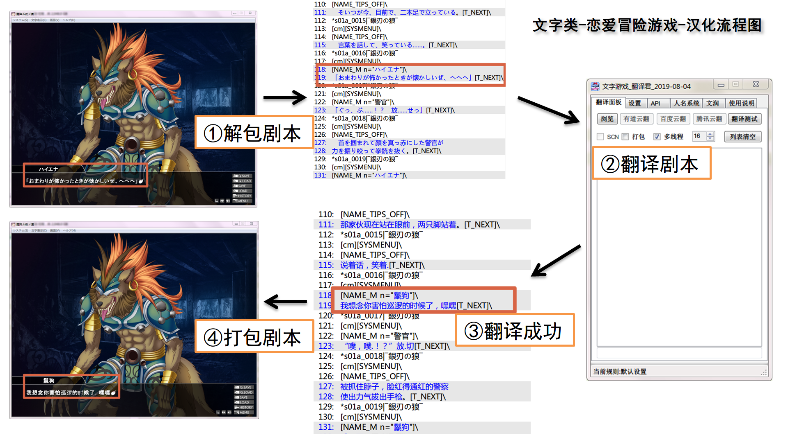
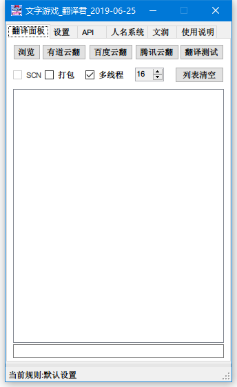
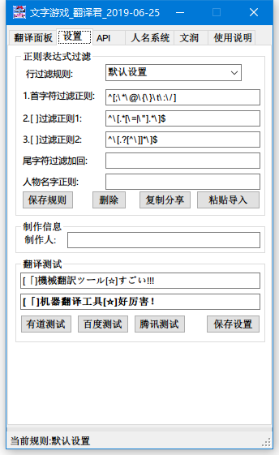
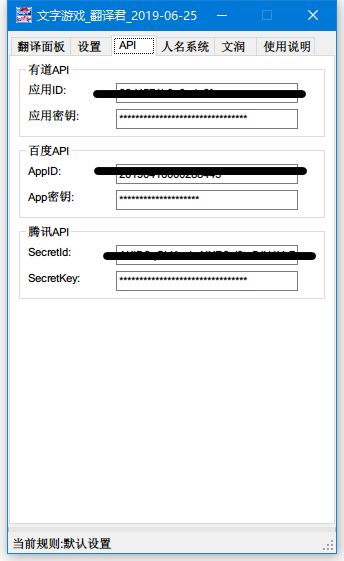

# 文字游戏 翻译君 使用说明 2019-08-28


### 文字游戏 翻译君 QQ群 [38552538](https://shang.qq.com/wpa/qunwpa?idkey=750821134ca5569c2215b66c9593df40851d615fe92aa5633af297a6cba96420) [度盘提取码:bb3b](https://pan.baidu.com/s/1qObSVEx6ZijYcia8QKic3w) 或git根目录 [过滤文本正则表达式仓库](https://sh2288.github.io/krkr_translator/%E6%AD%A3%E5%88%99%E8%A1%A8%E8%BE%BE%E5%BC%8F_%E4%BB%93%E5%BA%93(%E6%8C%89%E6%B8%B8%E6%88%8F%E5%8E%82%E5%95%86%E5%88%86%E7%B1%BB-%E9%80%9A%E8%BF%87%E7%B2%98%E8%B4%B4%E5%AF%BC%E5%85%A5%E5%8D%B3%E5%8F%AF%E4%BD%BF%E7%94%A8).md)

>#### [B站视频教程](https://www.bilibili.com/video/av69298736)
>#### [youtube视频教程](https://youtu.be/8aXjUVPenW8)

>#### 最新消息
```
2019-10-10
最近发现正向匹配可能要比过滤匹配要简单的多,而程序一开始是按照过滤匹配设计的,计划加入正向匹配(反向过滤)
2019-09-26
超详细傻瓜式WIKI图文+视频教程筹备中...
2019-09-03
过滤文本正则表达式仓库建立
2019-08-28
当百度API的返回错误时,进行5次重试,极大减少百度API的出错几率,自定错误码正则为 --bd.*?bd--
2019-08-27
加入QPS选项设置后,百度的超限问题是没了,但又多了超时问题,解决中...
2019-08-26
加入百度和腾讯API的QPS选项设置
百度高级版设置10,普通版设置1,腾讯设置5
2019-08-16
游戏汉化翻译流程图解
2019-08-08
测试翻译的代码,忘记更改请求限制了,虽然不影响正式翻译,周末更正
2019-08-04
调整腾讯和百度的API请求频率(每秒不超过5),并限制百度和腾讯API不能使用多线程,保证翻译的稳定性
2019-07-19
百度翻译api更新,限制了api每秒调用次数,多线程不可用(以前用多线程可是很快的)
```




>#### 软件特性:
```
1.文本文件任意支持的语言(见API支持语言列表)翻译成中文(并不局限于ks或scn文件)
2.翻译好的文件编码为utf16le有签名
3.自动识别编码shift-jis和utf8,utf16,gb2312等(utf16be无签名除外)
4.由正则过滤不需要翻译的行,以及其他不需要翻译的内容,精准提取文本
5.调用有道和百度api翻译,腾讯API接口(腾讯API有每秒5次请求限制,暂时无法使用多线程),由于api额度有限,需用户自行申请
6.scn解文本封文本自动处理
7.翻译完成自动打包xp3(可选项)
8.翻译字数统计(实际略多于api实际翻译字数,误差大概10%以内)只精确到翻译行的字数,行内不需要翻译的字忽略不计
9.人名修改系统,通过正则提取游戏内人物"说话"时的名字,请根据翻译参考或游戏人物参考对照修改
10.采用多线程同时翻译多个文件,目前最大支持32个文件同时翻译,效率是以前的单文件的32倍
11.添加制作人信息,会在每次翻译最开始的文本前插入此信息(xxxx制作)这样的文字,仅插入一次
12.文润系统(后期处理文本用,可以将API返回的常见错误加以修正,例如翻译好的文本中有大量的AAAA,AAAA是api返回的翻译结果,但并不是正确的结果,通过文润系统可以将所有文本中的AAAA,全部换成您设定好的BBBB,文润系统尽量让原始字符多的排在最前面)
13.加入自动激活功能,目前只支持支付宝付款后的自动激活
14.针对百度和腾讯的翻译API,添加QPS选项,百度高级版设置10,普通版设置1,腾讯设置5
```
>#### 文字游戏_翻译君 内置工具列表 软件目录\data\下的工具不请要改动
* \tools\ Emeditor(支持多编码转换的文本编辑器)
* \data\ PsbTextDumperV2和PsbTextInserter(PSB文本命令行处理工具)(SCN这个后面详细说)
* \tools\ GARbro(解包打包)
* \data\ krkrrel(打包)
* \tools\ XP3Viewer.exe(解包打包)(待添加)
* \tools\ KrkrExtract4.0.1.4(解包打包)

>#### 已知BUG:(请尽量避免以下操作)
```
1.待翻译列表内的文件路径如果不同时,会出错.
2.SCN文件和ks文件同时出现在待翻译列表内,会出错.
3.规则全为空时,翻译scn会出错,但不影响最终结果.
```

>#### 使用说明:
```
1.文字游戏_机翻君-->浏览-->选择需要翻译的剧本文件*.ks或*.txt(一定要确认不是utf16be无签名的)*.scn不用管,一键直翻即可
2.翻译完成后替换掉原始的剧本文件*.ks
3.打包进游戏测试
4.人名系统正则表达式例子 (?<=^\[NAME_[MW] n=\").+(?=\"\]\\$) 匹配下句中的 [NAME_W n="xxxx"]\ xxxx部分
```
>#### 云翻译API申请方法:
-- | 云翻译API申请方法
----|---
有道| [有道智云](https://ai.youdao.com/)-->自然语言翻译-->翻译实例-->创建实例-->名称XX选文本翻译-->应用管理-->我的应用-->创建-->API方式-->绑定刚刚的翻译实例-->记下应用ID和应用密钥并确认已经绑定翻译实例--有道智云给新用户100元,翻译按字数收费
百度| [百度翻译开放平台](http://api.fanyi.baidu.com/api/trans/product/index)-->开通通用翻译API-->每个月200万字符免费,超出按字数收费
腾讯|[腾讯AI开放平台](https://ai.qq.com/)-->文本翻译-->免费试用-->按提示操作即可


>#### 更新说明
```
1.修复腾讯api设置不能保存的bug
2.更改原来的翻译方向jp-->zhs,改为auto-->zhs,也就是说可以将任意支持的语言(见API支持语言列表)翻译成中文
3.tools下添加xmoeproject/KrkrExtract4.0.1.4解包打包工具----官网 https://github.com/xmoeproject/KrkrExtract
```

>#### 位置说明:
```
KS,所有翻译好的文本和xp3封包位于翻译文件的目录下的\trans_cn_****\目录下
SCN,所有翻译好的文本位于翻译文件的目录下的\trans_cn_****\目录下,所有翻译后生生成的scn和xp3封包位于\trans_cn_test\OutScript\目录下
```

>#### 其他:

##### 新浪博客--http://blog.sina.com.cn/u/1403364340

##### QQ空间--https://user.qzone.qq.com/27001095

##### Git地址--https://sh2288.github.io/krkr_translator
